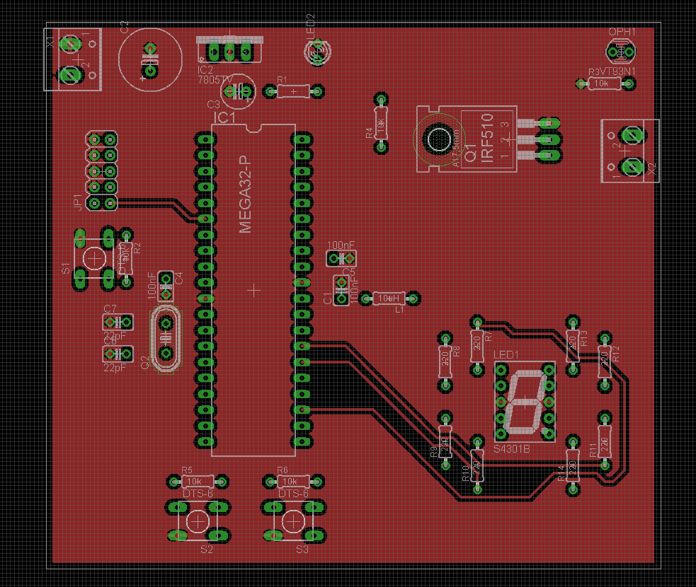
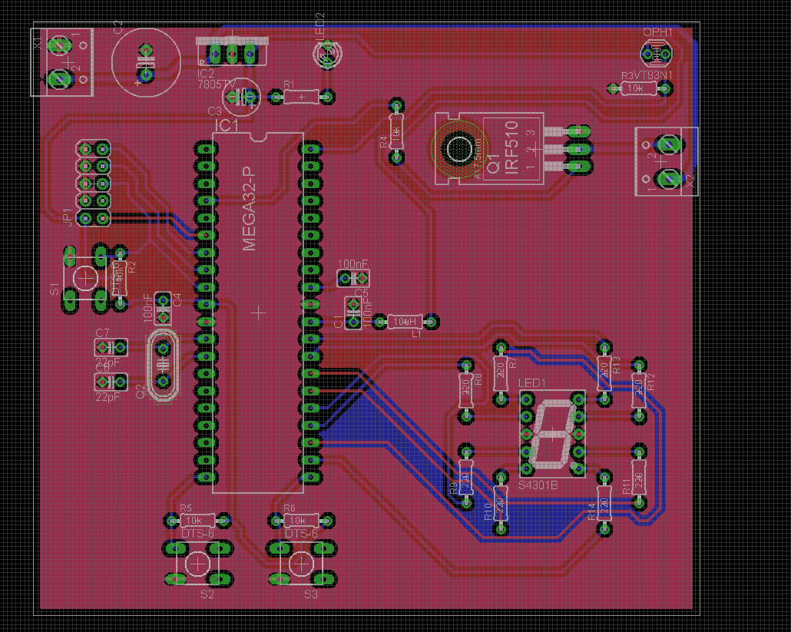
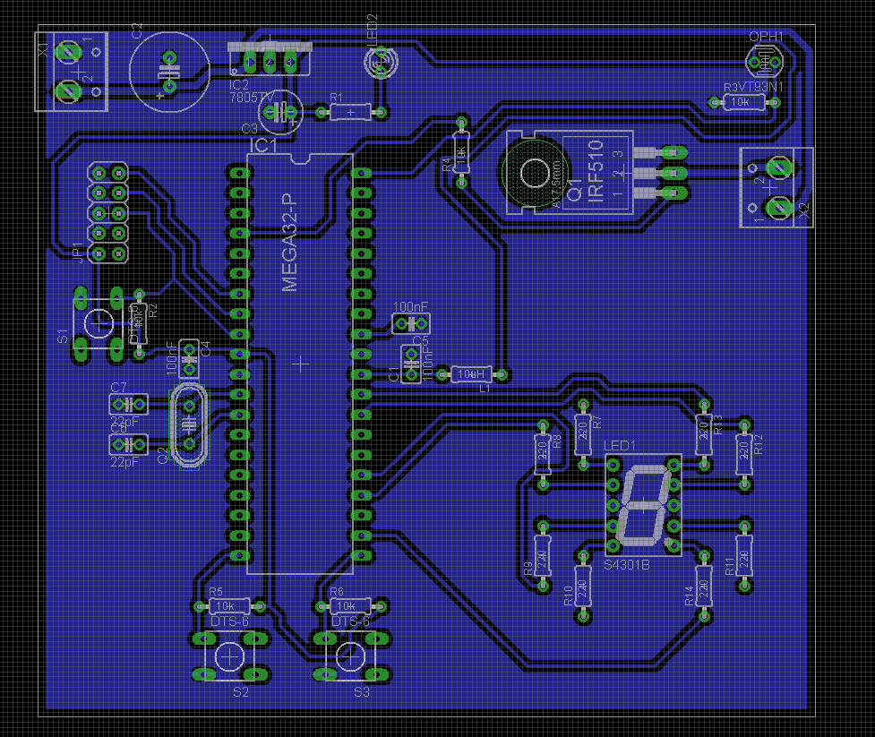
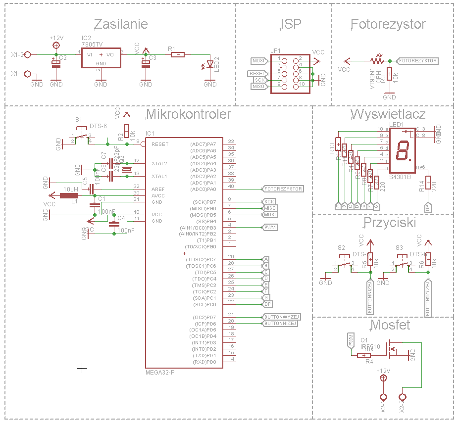
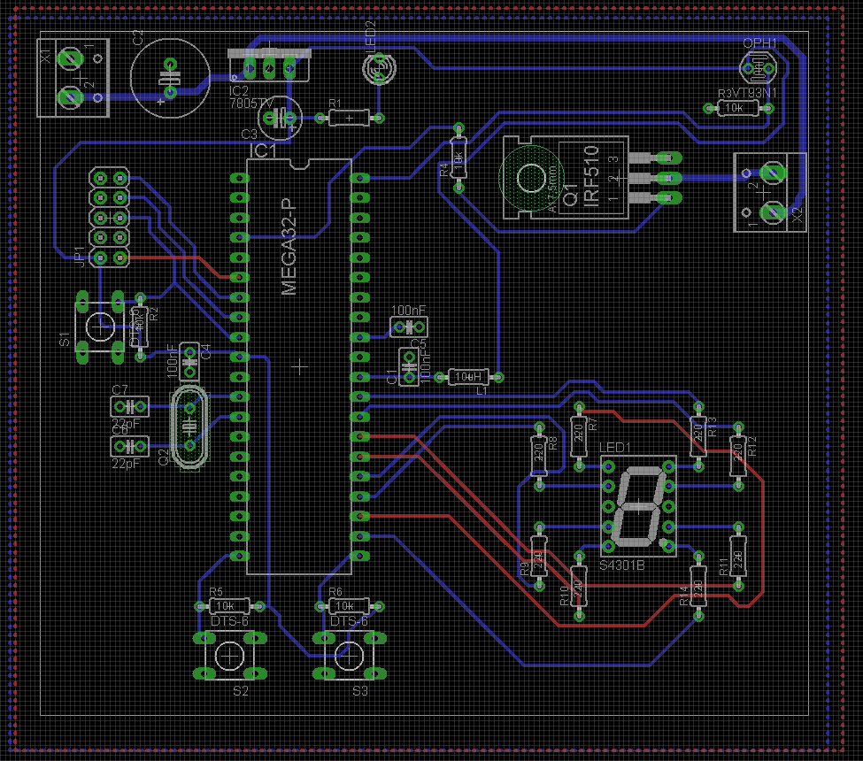

# Szymon Piwiński
Sterownik sterowania natężeniem światła
# Zarys działania projektu:
Wyświetlacz pokazuje wartości od 0 do 9 i definiuje to jak mocno ma świecić lampa.
Im ciemniej robi się w pomieszczeniu, tym bardziej rozjaśnia się lampa aż do 
poziomu ustalonego na wyświetlaczu. Taki projekt może mieć zastosowanie na przykład
w szklarni. Roślina która potrzebuje ciągłego oświetlenia na określonym poziomie 
ma je zapewnione dzięki aparaturze, która dostosowuje automatycznie poziom natężenia 
oświetlenia.
# Elementy potrzebne do wykonania projektu:
- stabilizator 5V L7805ABV - THT TO220
- wyświetlacz 8-segmentowy - wsp. katoda
- fotorezystor 10K
- mikrokontroler ATmega32A-PU - DIP
- kable
# Schemat płytki w programie Eagle:

# Kod programu
#include <avr/io.h>
#include <util/delay.h>

#define PWM (1<<PB3)
#define buttonWyzej (1<<PD7)
#define buttonNizej (1<<PD6)

#define a (1<<PC7)
#define b (1<<PC6)
#define c (1<<PC5)
#define d (1<<PC4)
#define e (1<<PC3)
#define f (1<<PC2)
#define g (1<<PC1)
#define dp (1<<PC0)

void init_wysw(int liczba){
PORTC = 0x00; //zerowanie IO
switch(liczba){
case 0:
PORTC |= a; PORTC |= b; PORTC |= c; PORTC |= d; PORTC |= e; PORTC |= f;
break;
case 1:
PORTC |= b; PORTC |= c;
break;
case 2:
PORTC |= a; PORTC |= b; PORTC |= d; PORTC |= e; PORTC |= g;
break;
case 3:
PORTC |= a; PORTC |= b; PORTC |= c; PORTC |= d;PORTC |= g;
break;
case 4:
PORTC |= b; PORTC |= c; PORTC |= f; PORTC |= g;
break;
case 5:
PORTC |= a; PORTC |= c; PORTC |= d; PORTC |= f; PORTC |= g;
break;
case 6:
PORTC |= a; PORTC |= c; PORTC |= d; PORTC |= e; PORTC |= f; PORTC |= g;
break;
case 7:
PORTC |= a; PORTC |= b; PORTC |= c;
break;
case 8:
PORTC |= a; PORTC |= b; PORTC |= c; PORTC |= d; PORTC |= e; PORTC |= f; PORTC |= g;
break;
case 9:
PORTC |= a; PORTC |= b; PORTC |= c; PORTC |= d; PORTC |= f; PORTC |= g;
break;
}
}

void initPWM0(unsigned int value) { //8bit
TCCR0 = 0b01101101;
OCR0 = value;
}

void init_ADC(){
	ADMUX |= (1 << REFS0);
	ADCSRA |= (1 << ADPS1) | (1 << ADPS0);
	ADCSRA |= (1 << ADEN);
}

int main(void){
	DDRB |= PWM;
	DDRC |= a;
	DDRC |= b;
	DDRC |= c;
	DDRC |= d;
	DDRC |= e;
	DDRC |= f;
	DDRC |= g;
	DDRC |= dp;

	PORTD |= buttonWyzej;
	PORTD |= buttonNizej;

int liczba=0;
int fotorezystor=0;
int zalaczanie = 500;//wtedy wlaczy lampe-popoludniowy odczyt
	while(1){
		ADCSRA |= (1 << ADSC);
		loop_until_bit_is_clear(ADCSRA, ADSC);
		_delay_ms(5);
		fotorezystor= ADC;
		if(PIND & buttonWyzej){
			if(liczba>=9){
				liczba=0;
			}
			else{
				liczba++;
			}
			_delay_ms(200);
		}
		if(PIND & buttonNizej){
			if(liczba<=0){
				liczba=9;
			}
			else{
				liczba--;
			}
			_delay_ms(200);
		}
		init_wysw(liczba);
		if(fotorezystor <= zalaczanie){
			PORTC |= dp;
			switch(liczba){
			case 0:
				initPWM0(0); //nie wlaczamy
			break;
			case 1:
				if(fotorezystor>=475){
				initPWM0(500-fotorezystor);
				}
				else if (fotorezystor<475){
					initPWM0(25);
				}
			break;
			case 2:
				if(fotorezystor>=450){
				initPWM0(500-fotorezystor);
				}
				else if (fotorezystor<450){
					initPWM0(50);
				}
			break;
			case 3:
				if(fotorezystor>=425){
				initPWM0(500-fotorezystor);
				}
				else if (fotorezystor<425){
					initPWM0(75);
				}
			break;
			case 4:
				if(fotorezystor>=400){
				initPWM0(500-fotorezystor);
				}
				else if (fotorezystor<400){
					initPWM0(100);
				}
			break;
			case 5:
				if(fotorezystor>=375){
				initPWM0(500-fotorezystor);
				}
				else if (fotorezystor<375){
					initPWM0(125);
				}
			break;
			case 6:
				if(fotorezystor>=350){
				initPWM0(500-fotorezystor);
				}
				else if (fotorezystor<350){
					initPWM0(150);
				}
			break;
			case 7:
				if(fotorezystor>=325){
				initPWM0(500-fotorezystor);
				}
				else if (fotorezystor<325){
					initPWM0(175);
				}
			break;
			case 8:
				if(fotorezystor>=300){
				initPWM0(500-fotorezystor);
				}
				else if (fotorezystor<300){
					initPWM0(200);
				}
			break;
			case 9:
				if(fotorezystor>=250){
				initPWM0(500-fotorezystor);
				}
				else if (fotorezystor<250){
					initPWM0(250);
				}
			break;
			}
		}
		else{
			initPWM0(0);
			if(PINC & dp){
				PORTC ^= dp;
			}
		}

	}

}
